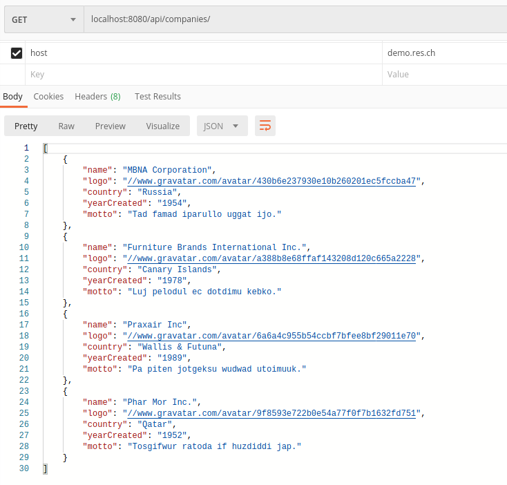
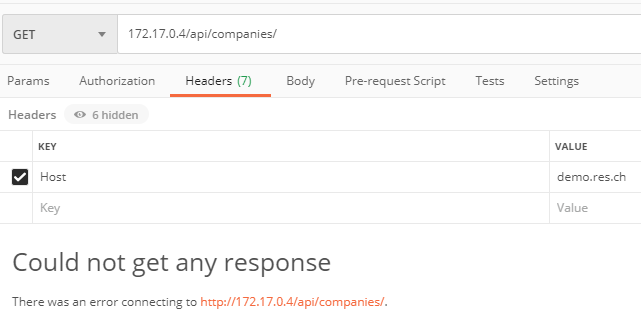
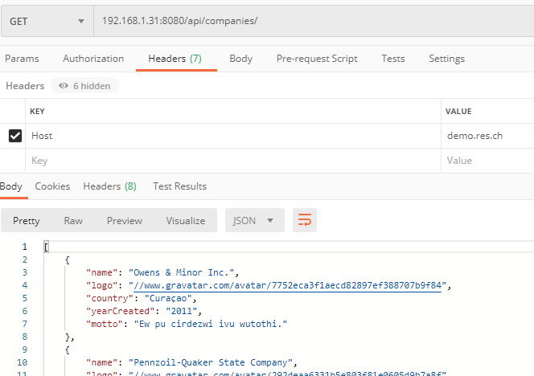
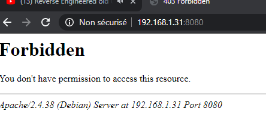

# Step 3: Reverse proxy with apache (static configuration)

## Mise en place manuelle

Lancement des containers crées précédemment (apache-php et express_student_express)

- `docker run -d --name apache_static res/apache-php`
- `docker run -d --name express_dynamic res/express_students_express`

Récuperer les adresses IP des deux containers

- docker inspect <container_name> | grep -i ipaddress


Run le container en mode interactif

- `docker run -p 8080:80 -it php:7.2-apache /bin/bash`
- Naviger dans la config des sites apache `cd /etc/apache2/sites-available`
- Copie de la config 000-default.conf en 001-reverse-proxy.conf
- Installation de vim `apt-get undate && apt-get install vim`
- Edit de la config 001

```
<VirtualHost *:80>
	ServerName demo.res.ch
	ErrorLog ${APACHE_LOG_DIR}/error.log
	CustomLog ${APACHE_LOG_DIR}/access.log combined
	
	# https://httpd.apache.org/docs/2.4/en/mod/mod_proxy.html
	ProxyPass "/api/companies/" "http://172.17.0.3:3000/"
	ProxyPassReverse "/api/companies/" "http://172.17.0.3:3000/"
	
	ProxyPass "/" "http://172.17.0.2:80/"
    ProxyPassReverse "/" "http://172.17.0.2:80/"
</VirtualHost>

```

- Activer le site `a2ensite 001*`
- Recharger le service apache `service apache2 reload`
  - On constate que les modules nécessaire à l'utilisation du reverse proxy ne sont pas activée
  - https://httpd.apache.org/docs/2.4/en/mod/mod_proxy.html indique quel module activer
    - `a2enmod proxy && a2enmod proxy_http && service apache2 restart`

- Maintenant on ne peut accéder aux pages construites précédemment (static et express) que par le proxy 

## Mise en place Dockerfile

- Copier dans le Dockerfile

```dockerfile
FROM php:7.2-apache

COPY conf/ /etc/apache2

RUN a2enmod proxy proxy_http
RUN a2ensite 000-* 001-*
```

- Le fichier `conf/sites-available/000-default.conf` est présent pour que demo.res.ch ne soit accessible si le header Host n'est pas précisé

```
<VirtualHost *:80>
</VirtualHost>
```

- Reprise de la configuration précédente pour`conf/sites-available/001-reverse-proxy.conf` 

```
<VirtualHost *:80>
	ServerName demo.res.ch
	ErrorLog ${APACHE_LOG_DIR}/error.log
	CustomLog ${APACHE_LOG_DIR}/access.log combined
	
	# https://httpd.apache.org/docs/2.4/en/mod/mod_proxy.html
	ProxyPass "/api/companies/" "http://172.17.0.3:3000/"
	ProxyPassReverse "/api/companies/" "http://172.17.0.3:3000/"
	
	ProxyPass "/" "http://172.17.0.2:80/"
    ProxyPassReverse "/" "http://172.17.0.2:80/"
</VirtualHost>
```

- Build de l'image
  - `docker build -t res/apache_rp .`

- Run le container
  - `docker run res/apache_rp`


Le script de démo se trouve dans `docker-images/apache-php-image`


> Pourquoi est-ce une config fragile qui doit être améliorée? 

Car les IPs sont hard codées, dépend de comment on redémarre les containers elles peuvent changer et le reverse proxy ne fonctionnerait plus (les containers contenant les site statique et dynamique ne seraient plus accessibles par le reeverse proxy)


> You can explain and prove that the static and dynamic servers cannot be reached directly (reverse proxy is a single entry point in the infra).

- Explain: no port mapping, the php and node containers are unreachable for the outside world
- Proof: need other PC, or bridged VM



On remarque que les container docker contenant nos sites statiques et dynamiques ne sont pas accessible. Logique car pas de port mapping, et ils n'ont que des IP privées (172.17.x.x). On ne peut donc y accéder que depuis le reverse proxy qui lui à un port mapping (dans cette config 8080 ==>  80)



Si on ne précise pas l'entête host, alors on obtient une erreur



Ceci à cause du fait qu'on a une configuration vide pour le site `000-default`

Il est possible d'accéder au site avec l'adrese `demo.res.ch` en éditant le fichier host de l'OS (le port doit être spécifié dans le navigateur, pas dans le fichier host)