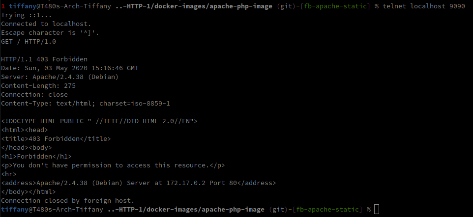

## Step 1: Static HTTP server with apache httpd

## Choix de l'image

We use the official php Docker image (https://hub.docker.com/_/php/)

Copy the lines into the Dockerfile

```dockerfile
FROM php:7.2-apache

COPY content/ /var/www/html/
```

## Exploration de l'image

`docker run -d -p 9090:80 php:7.2-apache`

`docker logs <container_name>` montre que Apache à bien démarré sans erreurs

Un telnet rapide nous montre que le serveur écoute sur le port 80 (port mapping de 9090 à 80) et répond, mais indique une erreur 403



On peut également accéder au serveur avec l'adresse 172.17.0.2:80

`docker exec -it <container_name> /bin/bash` Permet de lancer un shell interactif dans le container afin d'explorer le filesystem

- La configuration se trouve dsns /etc/apache2

## Ajout de contenu à notre image

Création d'un fichier index.html dans le dossier content/

Build de l'image

`docker build -t res/apache-php .`

Run de l'image

`docker run -p 9090:80 -d res/apache-php`

On peut mainteant afficher notre index depuis notre navigateur web

On peut laner un deuxième container basé sur notre image mais il faut chenger le port mapping

`docker run -p 9091:80 -d res/apache-php`

## Template

Téléchargement d'un template ~~random~~ sympa https://bootstrapmade.com/knight-free-bootstrap-theme/

dézip dans le dossier contenu, rebuild de l'image, lancement du container basé sur l'image avec les sources à jour, le template est maintenant visible sur notre server apache

### Personnalisation

Suppression de sections, modification de certains textes...

Il faut rebuild l'image, et re-run un container pour que ces modifications soient visible sur le serveur apache

