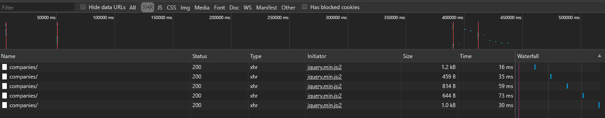

# Step 4: AJAX requests with JQuery

Arrêt de tous les containers
`docker kill <container_name> ...`
`docker rm $(docker ps -qa)`

Modification du Dockerfile de apache-php-image pour y installer nvim

```dockerfile
FROM php:7.2-apache

RUN apt update && apt install -y neovim

COPY content/ /var/www/html/
```

`docker build -t res/apache-php .`


Même chose pour apache-reverse-proxy

```dockerfile
FROM php:7.2-apache

RUN apt update && apt install -y neovim

COPY conf/ /etc/apache2

RUN a2enmod proxy proxy_http
RUN a2ensite 000-* 001-*
```

`docker build -t res/apache_rp .`


Et finalement pour express-image-*

```dockerfile
FROM node:12.16.3

RUN apt update && apt install -y neovim

COPY src/ /opt/app

CMD ["node", "/opt/app/index.js"]
```

`docker build -t res/express_students_node .`

`docker build -t res/express_students_express .`


On rerun les containers apache_php, express_students_express, et apache_rp dans le même ordre qu'à l'étape précédante (pour avoir on l'espère les mêmes IP)

`docker run -d --name apache_static res/apache-php `

`docker run -d --name express_dynamic res/express_students_express`

`docker run -d -p 8080:80 res/apache_rp`

On test et constate que le tout fonctionne (dans le cas ou le dossier nodes_modules ne serait plus présent, il faut faire un npm install dans le dossier contenant package.json et rebuild l'image)


Se logguer dans la machine apache_static

`docker exec -it apache_static /bin/bash`

Backup de index.html `cp index.html index.html.ori`

Ajout d'in ID  sur le texte à modifier et ajout de la balise script avant le fermeture du body

```html
...
<p id="teamTextToChange">Magnam dolores commodi suscipit eius consequatur ex aliquid fuga eum quidem</p>
...
<!-- Custom script to change Team text -->
<script src="assets/js/customText.js"></script>
...
```

Création du script customText.js dans le dossier assets/js

```javascript
$(function() { //Periodically updates the Team text with AJAX
        console.log("Changing text");

        function loadMotto() {
                $.getJSON("api/companies/", function(companies) {
                        console.log(companies);
                        //companies always contains at least 1 company
                        var message = companies[0].motto;
                        $("#teamTextToChange").text(message);
                });
        };
        
        // Text is changed every 5 seconds
        setInterval(loadMotto, 5000);    

});
```

On peut tester le fonctionnement en affichant la page statique et on voit que le texte change bien toutes les 5 secondes

On peut aussi voir les requêtes avec les dev tools du navigateur (Dans Network/XHR)




On peut maintenant appliquer ces modifications à l'image docker, puis la rebuild, le rerun (on espere que l'adresse IP est la même)


You are able to explain why your demo would not work without a reverse proxy (because of a security restriction).

https://en.wikipedia.org/wiki/Same-origin_policy