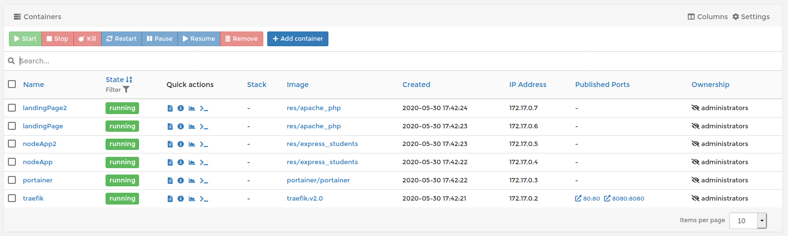
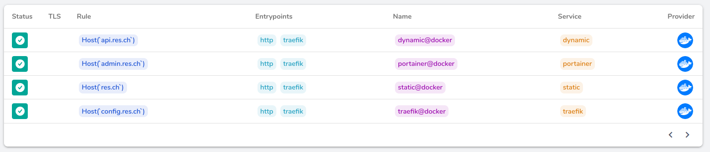

# Additional steps to get extra points on top of the "base" grade

## Management UI

Pour la management UI, on connaissait [Portainer](https://www.portainer.io/) et avons donc décidé de l'implémenter sur le système, principalement car nous apprécions l'idée d'avoir un système de gestion qui lui-même est un container.

Pour l'utilisation, rien de très compliqué, tout d'abord il est nécessaire de créer un volume pour les données qui vont être utilisées : `docker volume create portainer_data`.

Ensuite on démarre le container

```bash
docker run -d -p 9000:9000 --name=portainer --restart=always -v /var/run/docker.sock:/var/run/docker.sock -v portainer_data:/data portainer/portainer
```

À partir de là, une interface est disponible à l'adresse [localhost sur le port 9000](http://localhost:9000/).

[](https://github.com/Sicriss/Teaching-HEIGVD-RES-2020-Labo-HTTPInfra/blob/master/images/portainer.png)

Au premier lancement, il faut définir un mot de passe pour l'admin, et séléctionner Local Docker environement

Plus tard nous utiliserons un script de lancement intitulé `portainer.sh` qui permet de simplifier l'utilisation des nombreuses options de lancement et inclura les *labels* que nous décrirons ci-dessous. Le script est tout de même disponible ci-dessous.

```bash
#!/bin/bash

# On lance le container avec les bons labels et tout :)
docker run -d --name=portainer \
        --label "traefik.http.routers.portainer.rule"="Host(\`admin.res.ch\`)" \
        --label "traefik.http.services.portainer.loadbalancer.server.port"="9000" \
        --restart=always \
        -v /var/run/docker.sock:/var/run/docker.sock \
        -v portainer_data:/data portainer/portainer
```

## Load Balancing, Clusters & Sticky Sessions

Les trois points ci-dessus sont originalement distincts mais seront documentés ensembles. En effet nous avons décidé d'utiliser *Traefik* afin de gérer ces points et nous éloignons donc de la découpe d'origine, prévue pour une implémentation via Apache. L'idée d'origine était de faire ceci via *Docker Swarm* mais avoir plusieurs clusters sur la même machine semblait compliqué et nous avons par conséquent opté pour une solution plus haut niveau.

*Traefik* tire profit de labels ajoutés aux containers pour activer des services ou pour son routage, il est entre autre utilisé avec *docker-compose* mais nous allons ici simplement ajouter les labels correspondants dans les *Dockerfile* et des scripts de lancement ce qui fonctionne tout aussi bien.

Premièrement il faut lancer un container *Traefik* afin d'activer le dit service, nous faisons ceci à l'aide d'un script `traefik.sh` qui est disponible ci-dessous.

```bash
#!/bin/bash


docker run -d -p 8080:8080 -p 80:80 --name traefik \
        --label "traefik.http.routers.traefik.rule"="Host(\`config.res.ch\`)" \
        --label "traefik.http.services.traefik.loadbalancer.server.port"="8080" \
        -v $PWD/traefik.yml:/etc/traefik/traefik.yml \
        -v /var/run/docker.sock:/var/run/docker.sock \
        traefik:v2.0
```

Et du coup, ce fichier `traefik.yml` ? On peut normalement y faire plein de configuration supplémentaire mais nous ne l'utilisons au final pas vraiment, il y a tout de même une règle par défaut de définie pour les containers fournis par `Docker` qui est que l'hôte demandé doit être `res.ch`.

### Clusters, session qui collent et répartition de charge

Ensuite sur *Traefik* les deux concepts principaux que nous utilisons sont les *services* et les *routeurs*. On peut définir des routeurs puis attribuer à ces derniers des règles pour les containers qu'on lance, même chose avec les services. Pour des raisons de simplicité nous allons ici utiliser un routeur et un service pour représenter les quatre aspects de notre architecture (statique, dynamique, management UI & Traefik).

Comme vous le voyez ci-dessus, nous avons attribué à Traefik un service du même nom, lui avons assigné le rôle d'effectuer du load balancing et nous avons indiqué à Traefik sur quel port le service était, ici il s'agit du port *8080* par exemple. Nous avons indiqué à notre routeur dedié que nous souhaitions répondre lorsque l'hôte était `config.res.ch`.

Même chose pour *Portainer* avec un service de loadbalancing qui écoute sur le port 9000 et répond à l'appel de l'host `admin.res.ch`, mais dans les deux cas ci-dessous on se contente d'un container (surtout pour une démonstration) .

Par contre, pour nos containers statiques et dynamiques, il est très intéressant d'avoir un routeur dedié ainsi qu'un service de loadbalancing qui contacte les containers avec le label concerné et sur le port indiqué, non seulement cela nous permet d'effectuer du *dynamic clustering* (les containers ajoutés ou retirés sont automatiquement gérés par le service) mais en plus le service de *load balancing* effectue ... son nom est très explicite. En plus, il paraît qu'une simple option ajoutée va permettre au service susmentionné de conserver le serveur qui répond dans un cookie et ainsi de faire des *sticky sessions*, magnifique.

(Il est important de noter que si le serveur auquel le client est connecté est éteint ou devient considéré *unhealthy* pour une raison ou une autre alors la requête sera dirigée vers un nouveau serveur.)

[](https://github.com/tiffanybonzon/Teaching-HEIGVD-RES-2020-Labo-HTTPInfra/blob/master/images/routes.png)

Maintenant comment activer les labels en questions sur les containers ? Rien de plus facile, un attribut *LABEL* existe pour les fichiers de configuration Docker et la documentation *Traefik* fait le reste.

Dockerfile pour notre image statique (apache_php)

```dockerfile
LABEL traefik.http.routers.static.rule=Host(`res.ch`)
LABEL traefik.http.services.static.loadbalancer.server.port=80
LABEL traefik.http.services.static.loadbalancer.sticky.cookie.name="stickyCookie"
```

Dockerfile pour notre image dynamique (express_students)

```Dockerfile
LABEL traefik.http.routers.dynamic.rule=Host(`api.res.ch`)
LABEL traefik.http.services.dynamic.loadbalancer.server.port=3000
```

Et voilà, les containers *built* avec cette nouvelle configuration seront gérés automatiquement.

### Donc ... tout fonctionne ?

Non. Nous avons procédé à une modification majeure qui est la transformation de notre `/api/` en un sous-domaine à part entière, il est donc nécessaire d'adapter le code de notre site statique. En conséquence, l'URL doit être adaptée dans le fichier `customText.js` afin de faire la requête au bon endroit.

### C'était donc si simple ?

Encore non. En rechargeant notre page HTML nous constatons que le code dynamique n'est pas affiché, en ouvrant la console de *debug* on constate un message d'erreur.

```
The Same Origin Policy disallows reading the remote resource at [URL]
```

Ce message est tout à fait normal, cette *policy* est implémentée par les navigateurs (web pas Christophe Colomb) et permet de vérifier que les scripts utilisent des données de la même *origine* (essentiellement vérifié par le nom de domaine et le port), il prévient notamment les attaques CSRF ou autres attaques qui exploitent une page web afin de voler le contenu d'une autre ou des données personnelles.

Pour résoudre ceci, on va dire à notre application dynamique derrière l'API de retourner des en-têtes qui autorisent spécifiquement les requêtes qui vont lui être faites.

```
app.use(function(req, res, next) 
{
    res.header("Access-Control-Allow-Origin", "*");
    res.header("Access-Control-Allow-Headers", "Origin, X-Requested-With, Content-Type, 		Accept");
    next();
});
```

En plaçant ce code au début de notre fichier `index.js`alors on s'est assuré d'accepter les requêtes de toutes les origines. On aurait également pu le faire uniquement pour les requêtes venant de `res.ch` mais cela semble censé d'accepter les requêtes quand on s'appelle *API* et puis nous ne sommes bien heureusement pas étudiants de la filière sécurité.

### Et maintenant ?

Voilà, nos routes sont configurées, il faut les ajouter au fichier hôte (les 4) puis on peut tester localement, il est maintenant très simple d'étendre l'infrastructure si désiré et de gérer d'avantage de containers à la volée.

De petites améliorations seraient possibles (par exemple on pourrait désactiver l'accès *Traefik* depuis le port 8080 de `res.ch`) mais il s'agit là de perfectionnement.

### Démonstration

Dans le but de préparer au mieux la démonstration et de lancer automatiquement les containers présentés, pour cela nous avons créé un petit script `demo.sh` dans notre dossier `docker-images`.

```bash
#!/bin/bash

docker stop `docker ps -qa`
docker rm `docker ps -qa`

# On s'assure d'avoir les dernières versions des images
docker build -t res/apache_php apache-php-image
docker build -t res/express_students express-image

# On lance tout d'abord les deux containers admin / config 
$("pwd")/traefik.sh
$("pwd")/portainer.sh

# On lance ensuite deux containers de chaque type 
docker run -d --name nodeApp res/express_students 
docker run -d --name nodeApp2 res/express_students 
docker run -d --name landingPage res/apache_php
docker run -d --name landingPage2 res/apache_php
```