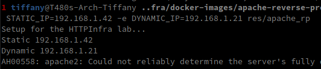

# Step 5: Dynamic reverse proxy configuration

- Arrêt de tous les containers
  - `docker kill <container_name> ...`
  - `docker rm $(docker ps -qa)`

- On test de pouvoir passer des variables au container
  - https://docs.docker.com/engine/reference/run/#env-environment-variables
  - `docker run -e IP1=192.168.1.42 -e IP2=192.168.1.21 -it res/apache_rp /bin/bash`
    - On peut faire echo $IP1 dans le container pour voir que la variable est correctement passée


- On récupère le fichier apache2-foreground du repo git https://github.com/docker-library/php
  et on y ajoute juste avant la ligne `exec apache2 -DFOREGROUND "$@"`

```bash
# Add setup for RES lab
echo "Setup for the HTTPInfra lab..."
echo "Static $STATIC_IP"
echo "Dynamic $DYNAMIC_IP"
```

- Le rendre exécutable
  - `chmod 755 apache2-foreground` 

- Modifier le Dockerfile pour remplacer apache2-foreground par notre version de ce script
  - (on peut voir dans https://github.com/docker-library/php/blob/master/apache-Dockerfile-block-2 que c'est bien dans /usr/local/bin qu on doit copier notre script)

```dockerfile
FROM php:7.2-apache

RUN apt update && apt install -y neovim

COPY apache2-foreground /usr/local/bin/
COPY conf/ /etc/apache2

RUN a2enmod proxy proxy_http
RUN a2ensite 000-* 001-*
```

- Build et run
  - `docker build -t res/apache_rp`
  - `docker run -e STATIC_IP=192.168.1.42 -e DYNAMIC_IP=192.168.1.21 res/apache_rp`

- On constate que le tout fonctionne correctement



## Utilisation de PHP pour injecter les envvars dans un template

- reprise du fichier `001-reverse-proxy` , remplacement des `"` par `'` et ajout des statements PHP pour récupérer les IP depuis les envvars

```php
<?php
        $static_ip = getenv('STATIC_IP');
        $dynamic_ip = getenv('DYNAMIC_IP');
?>

<VirtualHost *:80>
        ServerName demo.res.ch
        ErrorLog ${APACHE_LOG_DIR}/error.log
        CustomLog ${APACHE_LOG_DIR}/access.log combined

        # https://httpd.apache.org/docs/2.4/en/mod/mod_proxy.html
        ProxyPass '/api/companies/' 'http://<?php print $dynamic_ip ?>/'
        ProxyPassReverse '/api/companies/' 'http://<?php print $dynamic_ip ?>/'
        
        ProxyPass '/' 'http://<?php print $static_ip ?>/'
        ProxyPassReverse '/' 'http://<?php print $static_ip ?>/'
</VirtualHost>
```

- Copie du nouveau fichier dans le container en modifiant le Dockerfile

```dockerfile
...
COPY templates/ /var/apache2/templates
# Déplacement du a2ensite dans apache2-foreground car php n'a pas encore généré le site 001
...
```

- Modifier notre fichier `apache2-foreground` pour exécuter notre script php

```bash
...
echo "Dynamic $DYNAMIC_IP"
php /var/apache2/templates/config-template.php > /etc/apache2/sites-available/001-reverse-proxy.conf
a2ensite 000-* 001-*
...
```

- Build et run
  - `docker build -t res/apache_rp`
  - `docker run -e STATIC_IP=192.168.1.42 -e DYNAMIC_IP=192.168.1.21 res/apache_rp`  
- Vérification de la copie et des scripts
  - `docker exec -it <container_name> /bin/bash` 

## Test de l'infrastructure

Le test de l'infrastructure se fait avec le script situé dans `docker-images`