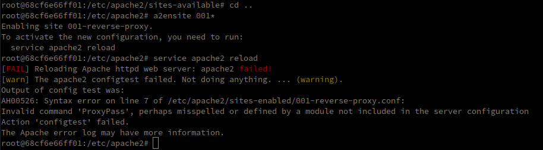

## Step 3: Reverse proxy with apache (static configuration)

Lancement des containers crées précédemment (apache-php et express_student_express)

- `docker run -d --name apache_static res/apache-php`
- `docker run -d --name express_dynamic res/express_students_express`

Récuperer les adresses IP des deux containers

- docker inspect <container_name> | grep -i ipaddress


Run le container en mode interactif

- `docker run -p 8080:80 -it php:7.2-apache /bin/bash`
- Naviger dans la config des sites apache `cd /etc/apache2/sites-available`
- Copie de la config 000-default.conf en 001-reverse-proxy.conf
- Installation de vim `apt-get undate && apt-get install vim`
- Edit de la config 001

```
<VirtualHost *:80>
	ServerName demo.res.ch
	ErrorLog ${APACHE_LOG_DIR}/error.log
	CustomLog ${APACHE_LOG_DIR}/access.log combined
	
	# https://httpd.apache.org/docs/2.4/en/mod/mod_proxy.html
	ProxyPass "/api/companies/" "http://172.17.0.3:3000/"
	ProxyPassReverse "/api/companies/" "http://172.17.0.3:3000/"
	
	ProxyPass "/" "http://172.17.0.2:80/"
    ProxyPassReverse "/" "http://172.17.0.2:80/"
</VirtualHost>

```

- Activer le site `a2ensite 001*`
- Recharger le service apache `service apache2 reload`
  - On constate que les modules nécessaire à l'utilisation du reverse proxy ne sont pas activée
  - https://httpd.apache.org/docs/2.4/en/mod/mod_proxy.html indique quel module activer
    - `a2enmod proxy && a2enmod proxy_http && service apache2 restart`

- Maintenant on ne peut accéder aux pages construites précédemment (static et express) que par le proxy 


Pourquoi est-ce une config fragile qui doit être améliorée? IP hard codées, dépend comment en redémarrant les containers elles peuvent changer et le reverse proxy ne fonctionnerait plus (les pages ne seraient plus accessible vu qu'on a du port mapping que pour le reverse proxy)


You can explain and prove that the static and dynamic servers cannot be reached directly (reverse proxy is a single entry point in the infra).

- Explain: no part mapping, the php and node containers are unreachable for the outside world
- Proof: need other PC, or bridged VM